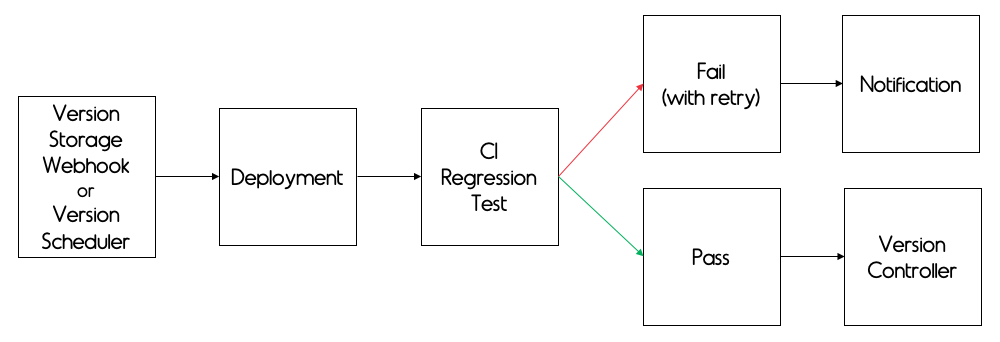
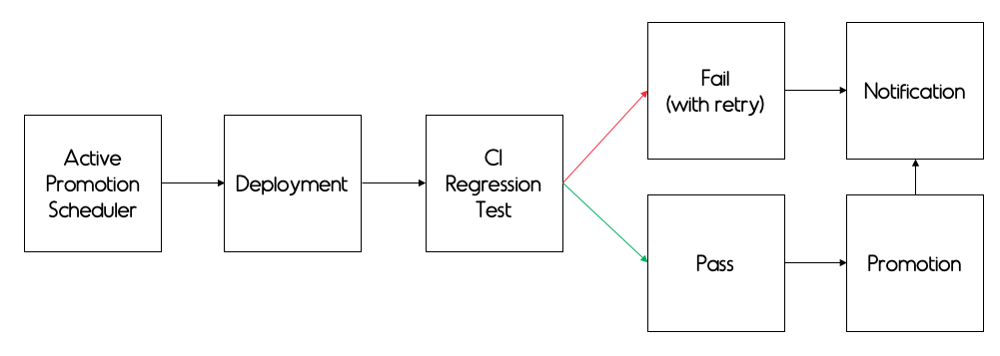
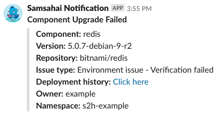
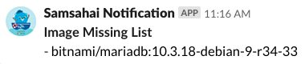
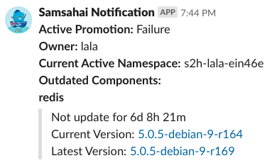

## Samsahai (S2H)
  

> Create self-update environment on Kubernetes

If your team is interested using Samsahai, you can create your pull request following this document [here](https://github.agodadev.io/docker/samsahai-config/tree/master/starter).

After your pull request had been merged, your team staging namespace is created automatically with prefix `s2h-<team_name>`.

---

## Table of Contents

- [More about Samsahai](#more-about-samsahai)
- [Samsahai in Details](#samsahai-in-details)
- [Swagger](#samsahai-api-is-available-here)

---

## More about Samsahai
#### Components
- Webhook – receive requests from a single source of truth (SSOT)​
- Active Scheduler – create and verify new active (stable) namespace​
- Staging Scheduler – verify new dependency version
- Version Controller – read and write current stable versions of a dependency​
- Reporting – send important notifications to Slack​
- Monitoring – collect metrics with Prometheus and visualize in Grafana​
- Logging – send logs to centralized logging endpoint​
- Plugins – customize with your own scripts​

#### Staging Workflow
- The staging workflow is for verifying your new component version by running tests against staging environment.
  - Once the tests pass, the verified component version will be marked as `stable`.
Unfortunately, if it is failed, the verified component version will be re-queued to verify in next round.
If it is still failed until reaching the retry limits (configurable), the component upgrade notification will be sent.

#### Active Workflow
- The active workflow is for promoting all updated stable components to be ready to use for your team.
By the way, before promoting the new active environment, Samsahai will create `pre-active` namespace
to run tests against its environment.

  - In case the tests pass, the `pre-active` will be switched to `active`
and `old active` will be switched to `previous active` and waiting for destroying for a while
(depends on your `teardownDuration` config).
  - In case the tests fail, `pre-active` environment will be destroyed and you still live with `old active` environment safely.

#### Why we need 3 namespaces?
- As sometimes there are some PRs still testing with active environment, some configuration is changed and we don't want to break it.
So we let the `pre-active` namespace setting up and ready to be `active` without downtime.

#### Reporting
- Currently, Samsahai supports only notification on Slack, here are the example of notifications:

  - When component upgrade is failed in staging environment

    

  - When image missing is detected in staging environment

    

  - When active promotion is failed or passed in active environment

    

- Moreover, we also support sending report via rest API and your custom command plugin.
About how to integrate, please see the document from [here](https://github.agodadev.io/docker/samsahai-config/tree/master/starter).

---

## Samsahai in Details
#### Technology
- Go, ETCD, Kubernetes, Helm

#### CRDs
- We extend Kubernetes API to implement Samsahai

| No. | CRDs Name | Description | Scope |
| --- | --- | --- | --- |
| 1 | Teams | Monitor all events that happen to particular team | Cluster |
| 2 | Desired Components | Store queue event of particular component | Namespaced |
| 3 | Queues | Queue all components that going to upgrade | Namespaced |
| 4 | Queue Histories | Store queue event of particular component | Namespaced |
| 5 | Stable Components | Store the stable version of particular component | Namespaced |
| 6 | Active Promotions | Monitor all active promotion events that currently happen | Cluster |
| 7 | Active Promotion Histories | Store active promotion histories of particular active promotion | Cluster |

#### Samsahai API is available [here](https://samsahai.agoda.local/swagger/index.html#/)

---

### Related Projects:
- [`Flux - Helm Operator`](https://github.com/fluxcd/flux) - The GitOps Kubernetes operator

---