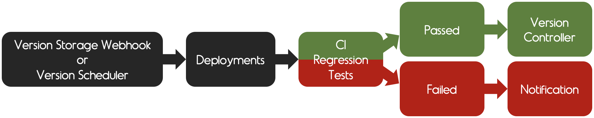
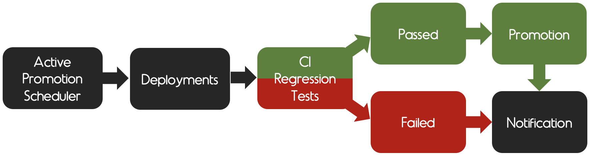

Samsahai (S2H)
==============
[![Samsahai Actions status badge]][Actions workflow results]
[![codecov status badge]](https://codecov.io/gh/agoda-com/samsahai)
[![Quay.io badge]](https://quay.io/repository/samsahai/samsahai)
[![License badge]](./LICENSE)

Dependencies verification system with Kubernetes Operator

## Introduction
Imagine if your testing environment is downstream and to make your environment ready, you need to spawn many services and their dependencies together. And our challenge requirement is not only providing the environment for testing but also providing the up to date dependencies. This is why we are introducing Samsahai. The system that will make your ready environment with freshness dependencies.

**Read more about Samsahai on [Medium](https://medium.com/agoda-engineering/testing-against-a-forest-of-dependencies-by-separating-them-into-trees-utilizing-k8s-operator-9047418ff208)**


## Overview
### Technology
Go, ETCD, Kubernetes, Helm

### Staging Workflow


This flow is for verifying your new component version by running regression tests against staging environment.
  - Once the testing passed, the verified version will be marked as `stable`.
  - Unfortunately, if it failed, the verified version will be re-queued to verify in next round.
If it is still failed until reaching retry limits (configurable), the component upgrade notification will be sent.

#### Verification Types
There are 2 verification types; upgrade and reverify.
1. **Upgrade** is a normal verification of particular component by deploying its desired version against all stable components.
2. **Reverify** will happen only when your desired version cannot be upgraded until reaching the maximum of retry time.
For this process, all stable components will be deployed instead which can help us to scope the issue either
environment, or the desired version issue.

#### Verification States
These are the meaning of verification states which happen in particular upgrading component version.


1. **Waiting:** the component is waiting for the verification process.
2. **Cleaning before:** cleaning the staging namespace before deploying components.
3. **Detecting image missing:** checking the desired version exists or not. If not this verification process will be finished.
4. **Creating:** deploying the component's desired version with other components' stable version.
4. **Testing:** testing the ready staging namespace against CI pipeline.
5. **Collecting:** collecting the result from CI pipeline.
6. **Cleaning after:** cleaning the staging namespace after deploying components.
7. **Finished:** the verification process has been finished.

##### Notes:
> - In case you want to verify components more than one at the same queue, you can do that by adding the components into `spec.bundles` field.  
> Please see the example in [config.yaml](https://www.github.com/agoda-com/samsahai/tree/master/examples/starter/crds/config.yaml).
> - In case you want to prioritize your components in queue to always be at the top of the queue, you can do that by adding the component or bundle into `spec.priorityQueues` field.  
> Please see the example in [config.yaml](https://www.github.com/agoda-com/samsahai/tree/master/examples/starter/crds/config.yaml).
> - In case you do not want to verify a component in staging flow which also want to mark all upcoming latest component version as stable, you can skip verifying process by defining the `spec.staging.deployment.engine` to be `mock`.  
> Please see the example in [config.yaml](https://www.github.com/agoda-com/samsahai/tree/master/examples/starter/crds/config.yaml).

### Active Promotion Workflow


This flow is for promoting new ready active environment of all stable components.
By the way, before becoming to be an active namespace, Samsahai will call the new namespace as `pre-active` first.

  - In case the testing passed, the `pre-active` will be switched to `active`
and `old active` will be switched to `previous active` and it will be destroyed in xx minutes depends on your `teardownDuration` configuration.
  - In case the testing failed, the switching namespace will not be proceeded and `pre-active` namespace will be destroyed.
So your `old active` namespace is still there as it is.

##### Notes:
> - At the promotion time, there will be 3 namespaces running in parallel; staging, pre-active and active.
> As in our use case, we use active namespace for testing the pull requests and we don't want to break it.
> So we let the `pre-active` namespace setting up finished, then we destroy `previous active` namespace without downtime.
> - In case you want to skip running test when promoting, you are allowed to do that by adding `skipTestRunner` flag in active-promotion.yaml.  
> Please see the example in [active-promotion.yaml](https://www.github.com/agoda-com/samsahai/tree/master/examples/starter/crds/active-promotion.yaml).

#### Active Promotion States
These are the meaning of verification states which happen in particular active promotion.


1. **Waiting:** the active promotion process is waiting in queue.
2. **Creating pre-active environment:** creating pre-active namespace.
3. **Deploying stable components:** deploying all stable components to pre-active namespace.
4. **Testing pre-active environment:** testing the ready pre-active namespace against CI pipeline.
5. **Collecting pre-active result:** collecting the result from CI pipeline
and there are 2 different processes between testing passes and fails.

**Testing Passes**
1. **Demoting active environment:** demoting previous active namespace.
2. **Promoting active environment:** promoting pre-active to active namespace.
3. **Destroying previous active environment:** destroying previous active namespace.
4. **Finished:** the active promotion process has been finished.

> Note: The rollback state can happen when demoting or promoting process is timeout.
> By the way, the new active namespace will be switched because the testing has passed.

**Testing Fails**
1. **Destroying pre-active environment:** destroying pre-active namespace.
2. **Finished** the active promotion process has been finished without switching active namespace.

## Installation
### Prerequisites
1. Install and setup [kubectl](https://kubernetes.io/docs/tasks/tools/install-kubectl/), please use the version below v1.16.0.
    ```
    curl -LO https://storage.googleapis.com/kubernetes-release/release/v1.15.10/bin/darwin/amd64/kubectl
    ```
   > Note: This is our preferred `kubectl` version. If you've already run the command above, do not forget to run step 2 and 3 following the official document.
2. Install [minikube](https://kubernetes.io/docs/tasks/tools/install-minikube/) with HyperKit driver
3. Install [minikube driver](https://minikube.sigs.k8s.io/docs/reference/drivers/)
   > Note: In our guideline, we use `HyperKit` driver.
4. Install [helm3](https://helm.sh/docs/intro/install/)
5. Install [Go v1.13](https://golang.org/doc/install#install)

### Environment Setup
- [Configuration](#configuration)
- [Minikube](#minikube)	
- [Run/Debug Locally](#rundebug-locally)

#### Configuration
Find more configuration information in [examples](https://www.github.com/agoda-com/samsahai/tree/master/examples)

#### Minikube
1. Create and access into samsahai directory in go path
    ```
    mkdir -p $GOPATH/src/github.com/agoda-com/samsahai && cd $_
    ```
2. Clone the project in directory above
3. Start minikube
    ```
    minikube start \
      --vm-driver=hyperkit \
      --cpus=4 \
      --memory=8192 \
      --kubernetes-version=v1.15.10
    ```
4. Install CRDs
    ```
    kubectl apply -f ./config/crds
    ```
5. Create and go into `samsahai-system` namespace
    ```
    kubectl create namespace samsahai-system
    kubectl config set-context --current --namespace=samsahai-system
    ```
6. Deploy samsahai by using `Helm`
    ```
    helm upgrade -i samsahai ./config/chart/samsahai
    ```
7. Verify samsahai is deployed successfully
    - `kubectl get pods`
    ```
    NAME                        READY   STATUS    RESTARTS   AGE
    samsahai-695c55fddd-z2gpj   1/1     Running   0          74s
    ```

    - `kubectl get services`
    ```
    NAME       TYPE       CLUSTER-IP       EXTERNAL-IP   PORT(S)          AGE
    samsahai   NodePort   10.105.227.248   <none>        8080:32501/TCP   10m
    ```
8. Get minikube IP
    - `minikube ip`
    ```
    192.168.64.14 (example of my minikube IP)
    ```
9. Now, you should be able to access
    ```
    http://<minikube_ip>:<node_port>/version (e.g. http://192.168.64.14:32501/version)
    http://<minikube_ip>:<node_port>/swagger/index.html# (e.g. http://192.168.64.14:32501/swagger/index.html#)
    ```
10. Apply configuration
    ```
    kubectl apply -f https://raw.githubusercontent.com/agoda-com/samsahai-example/master/configs/crds/config-example.yaml
    ```
11. Apply team
    ```
    kubectl apply -f https://raw.githubusercontent.com/agoda-com/samsahai-example/master/configs/crds/team-example.yaml
    ```
    > Now, `s2h-example` staging namespace should be created.

##### Upgrade Components
1. Upgrade `redis` and `mariadb` components by using Swagger `http://<minikube_ip>:<node_port>/swagger/index.html#`
    - `POST /webhook/component`
    ```
    {
      "component": "redis"
    }
    ```
    ```
    {
      "component": "mariadb"
    }
    ```
2. Switch to `s2h-example` namespace
   ```
   kubectl config set-context --current --namespace=s2h-example
   ```

   - `kubectl get desiredcomponents` (see desired components)
   ```
   NAME      AGE
   mariadb   29s
   redis     42s
   ```

   - `kubectl get queues` (the new version of particular component will be verified one by one following the queues)
   ```
   NAME      AGE
   mariadb   7s
   redis     20s
   ```

   - `kubectl get pods` (in s2h-example namespace, you will see all components that you specify in `components` of `samsahai.yaml` are running)
   ```
   NAME                                             READY   STATUS              RESTARTS   AGE
   example-s2h-example-redis-master-0               1/1     Running             0          66s
   example-s2h-example-wordpress-57ddb458d4-hqcfx   1/1     Running             0          66s
   example-s2h-example-wordpress-mariadb-0          1/1     Running             0          66s
   s2h-staging-ctrl-6c58794fd8-rtdfs                1/1     Running             0          15h
   ```

   - `kubectl get stablecomponents` (if your component is upgraded successfully, you can see them in stable components crd)
   ```
   NAME      AGE
   mariadb   3m50s
   redis     5m10s
   ```
To save the cluster resources once every upgrade component verification has finished, the running components will be terminated immediately. 

##### Promote New Active
1. Apply active-promotion
    ```
    kubectl apply -f https://raw.githubusercontent.com/agoda-com/samsahai-example/master/configs/crds/active-promotion-example.yaml
    ```
    > Now, `s2h-example-abcdzx` active namespace should be created, the active namespace will have last 6 characters randomly.
2. If you would like to see what is going on in active promotion flow
    ```
    kubectl describe activepromotions example
    ```
3. Switch to `s2h-example-abcdzx` active namespace
    ```
    kubectl config set-context --current --namespace=s2h-example-abcdzx  
    ```

    - `kubectl get pods` (in s2h-example-abcdzx namespace, you will see all components that you specify in config are running)
    ```
    NAME                                                    READY   STATUS    RESTARTS   AGE
    example-s2h-example-gdthjh-redis-master-0               1/1     Running   0          2m33s
    example-s2h-example-gdthjh-wordpress-6d794cb9bb-8vqhw   1/1     Running   0          2m28s
    example-s2h-example-gdthjh-wordpress-mariadb-0          1/1     Running   0          2m28s
    s2h-staging-ctrl-c566b7f66-5q9bh                        1/1     Running   0          2m43s
    ```

#### Run/Debug Locally
1. Create and access into samsahai directory in go path
    ```
    mkdir -p $GOPATH/src/github.com/agoda-com/samsahai && cd $_
    ```
2. Clone project in the directory above
3. Prepare environment and export KUBECONFIG
    ```
    make init
    make prepare-env-e2e-k3d
    export KUBECONFIG=/tmp/s2h/k3s-kubeconfig
    make install-crds
    ```
4. Run `samsahai controller` by using go build with following configurations:
    ```
    File: ${GOPATH}/src/github.com/agoda-com/samsahai/cmd/samsahai/main.go
    Envrionment: KUBECONFIG=/tmp/s2h/k3s-kubeconfig
    Program arguments: start --debug --pod-namespace samsahai-system --s2h-auth-token 123456
    ```
5. Now, you should be able to access
    ```
    http://localhost:8080/swagger/index.html#
    ```
6. Apply configuration
    ```
    kubectl apply -f https://raw.githubusercontent.com/agoda-com/samsahai-example/master/configs/crds/config-example.yaml
    ```
7. Apply team
    ```
    kubectl apply -f https://raw.githubusercontent.com/agoda-com/samsahai-example/master/configs/crds/team-example-local.yaml
    ```
    > Now, `s2h-example` staging namespace should be created.

##### Upgrade Components
1. Run `staging controller` by using go build with following configurations:
    ```
    File: ${GOPATH}/src/github.com/agoda-com/samsahai/cmd/staging/main.go
    Envrionment: KUBECONFIG=/tmp/s2h/k3s-kubeconfig
    Program arguments: start --debug --pod-namespace s2h-example --s2h-auth-token 123456 --s2h-server-url http://127.0.0.1:8080 --s2h-team-name example
    ```
2. Upgrade `redis` and `mariadb` components by using Swagger `http://localhost:8080/swagger/index.html#`
    - `POST /webhook/component`
    ```
    {
      "component": "redis"
    }
    ```
    ```
    {
      "component": "mariadb"
    }
    ```
After this step, you can see the result following [minikube upgrade component](#upgrade-component) part.

##### Promote New Active
1. Apply active-promotion
    ```
    kubectl apply -f https://raw.githubusercontent.com/agoda-com/samsahai-example/master/configs/crds/active-promotion-example.yaml
    ```
    > Now, `s2h-example-abcdzx` active namespace should be created, the active namespace will have last 6 characters randomly.
2. Switch to run another `staging controller` by modifying `--pod-namespace` to point to an active namespace
    ```
    --pod-namespace s2h-example-abcdzx
    ```
After this step, you can see the result following [minikube promote new active](#promote-new-active) part.

## Contribution Policy
Samsahai is an open source project, and depends on its users to improve it. We are more than happy to find you are interested in taking the project forward.

Kindly refer to the [Contribution Guidelines](https://github.com/agoda-com/samsahai/blob/master/CONTRIBUTING.md) for detailed information.

## Code of Conduct
Please refer to [Code of Conduct](./CODE_OF_CONDUCT.md) document.

## License
Samsahai is open source and available under the [Apache License, Version 2.0](./LICENSE).


[Samsahai Actions status badge]: https://github.com/agoda-com/samsahai/workflows/Samsahai/badge.svg
[Actions workflow results]: https://github.com/agoda-com/samsahai/actions?query=workflow%3ASamsahai
[codecov status badge]: https://codecov.io/gh/agoda-com/samsahai/branch/master/graph/badge.svg?token=mt0oLjFy0k
[Quay.io badge]: https://quay.io/repository/samsahai/samsahai/status "Docker Repository on Quay"
[License badge]: https://img.shields.io/badge/License-Apache%202.0-blue.svg
